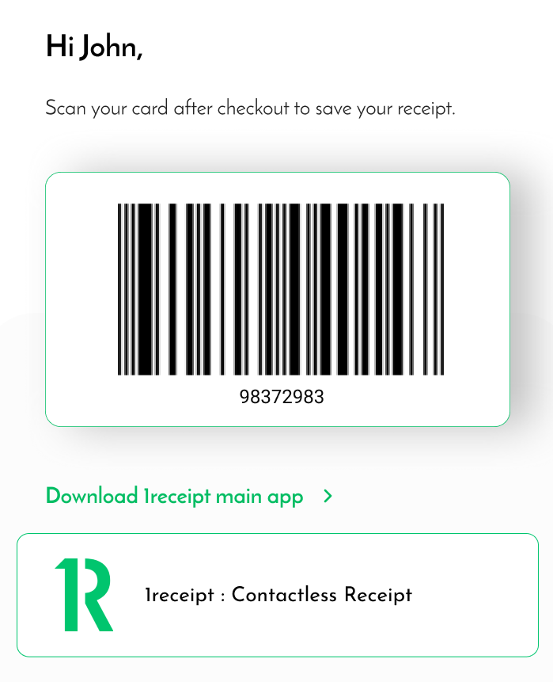

# 1Receipt OAuth

1receipt® OpenID™ allows for third party shopping app to integrate with 1receipt, for shopper to have a smoother process in createing a 1receipt account and be able to scan their 1receipt barcode at the checkout.

##### 1. Apply for 1receipt sandbox certification

- Fill in this [form](https://forms.gle/Yg5k1DgTWGchDPVv5) and we will get back to you in 24 hours.

- Once the checking has been past, one sandbox certification will be sent by email.

- The certificate contains `client_id` and `sign_in_domain` `user_pool_id` `region` `redirect_uri` for sandbox userpool.

##### 2. Using the System-Provided Buttons

- There are three colors and two types of buttons for you to choose
  
  - Continue with 1receipt button:
    - [Main button](ui/buttons/1receipt-id-continue-with_2x.png)
    - [Black button](ui/buttons/black_1receipt-id-continue-with_2x.png)
    - [Forest button](ui/buttons/forest_1receipt-id-continue-with_2x.png)
  - Icon button:
    - [Main Icon button](ui/buttons/icon-masked-circular_2x.png)
    - [Black Icon button](ui/buttons/black_icon-masked-circular_2x.png)
    - [Forest Icon button](ui/buttons/forest_icon-masked-circular_2x.png)

##### 3. Generate auth URL and integrate user consent dialog

- Generate auth URL

  - Format:

    ```
    https://<sign_in_domain>/login?client_id=<client_id>&response_type=code&scope=openid+profile&redirect_uri=<redirect_uri>
    ```

  - Example:

    ```
    https://www.1receipt.io/login?client_id=my_client_id&response_type=code&scope=openid+profile&redirect_uri=my_redirect_uri
    ```

- Integrate the user consent dialog: (TO BE UPDATED)
  - integrate the componetes for authorization
    - [Example Code ConsentDialog.js](ui/src/pages/components/dialogs/ConsentDialog.js)
    - [Example Code ConsentDialog.tsx](ui/src/pages/components/dialogs/ConsentDialog.tsx)
  - The content of this dialog must be
    ```
    Do you authorise 1receipt to share your accountId and firstName with <your_app_name>?
    ```
  - update <your_app_name> with your client name
  - The dialog must contains two buttons:
    `Allow` | `Cancel`
  - Buttons behaviour:
    - Cancel doesn't give permission and will stop the OpenID flow here meaning that will not go to step 4
    - Allow will continue the OpenID flow to step 4 to authenticate the user and redirect to the app
  - If the integration doesn't following the rules above, your request of production certificate will be rejected.

##### 4. Authenticating the user

- Open the URL generated in step 2 in browser
  
- After customer sign in with their account, this http request will redirect to the reditect_uri and contains `id_token` of this customer in query.

- Redirect request example:
  ```
  <redirect_uri>#id_token=<id_token>&expires_in=<expires_in>&token_type=Bearer
  ```

##### 5. Validating an ID token

- Confirm the Structure of the JWT
  - A JSON Web Token (JWT) includes three sections:
    1. Header
    2. Payload
    3. Signature
  - Example:
    `11111111111.22222222222.33333333333`
  - These sections are encoded as base64url strings and are separated by dot (.) characters. If your JWT does not conform to this structure, consider it invalid and do not accept it.
- Validate the JWT Signature

  - The JWT signature is a hashed combination of the header and the payload. Amazon Cognito generates two pairs of RSA cryptographic keys for each user pool. One of the private keys is used to sign the token.
  - To verify the signature of a JWT token:

    1. Decode the ID token.
       - The OpenID Foundation also maintains [a list of libraries for working with JWT tokens](https://openid.net/developers/jwt/).
    2. Compare the local key ID (kid) to the public kid.

       - Download and store the corresponding public JSON Web Key (JWK) for your credencial:
         - [Sandbox](jwks/sandbox.json)
         - [Production](jwks/production.json)
       - Fields in jwk:

         - Key ID (kid)
           The kid is a hint that indicates which key was used to secure the JSON web signature (JWS) of the token.
         - Algorithm (alg)
           The alg header parameter represents the cryptographic algorithm used to secure the ID token. User pools use an RS256 cryptographic algorithm, which is an RSA signature with SHA-256. For more information on RSA, see RSA Cryptography.

         - Key type (kty)
           The kty parameter identifies the cryptographic algorithm family used with the key, such as "RSA" in this example.

         - RSA exponent (e)
           The e parameter contains the exponent value for the RSA public key. It is represented as a Base64urlUInt-encoded value.

         - RSA modulus (n)
           The n parameter contains the modulus value for the RSA public key. It is represented as a Base64urlUInt-encoded value.

         - Use (use)
           The use parameter describes the intended use of the public key. For this example, the use value sig represents signature.

       - Search the public JSON web key for a kid that matches the kid of your JWT.

    3. Use the public key to verify the signature using your JWT library. You might need to convert the JWK to PEM format first. This example takes the JWT and JWK and uses the Node.js library, jsonwebtoken, to verify the JWT signature:
       ```
       var jwt = require('jsonwebtoken');
       var jwkToPem = require('jwk-to-pem');
       var pem = jwkToPem(jwk);
       jwt.verify(token, pem, { algorithms: ['RS256'] }, function(err, decodedToken) {
       });
       ```

- Verify the Claims:
  - To verify JWT claims：
    1. Verify that the token is not expired.
    2. The audience (aud) claim should match your app `client_id`
    3. The issuer (iss) claim should match your `user_pool_id` in the following format:
       ```
       https://cognito-idp.ap-southeast-2.amazonaws.com/<user_pool_id>.
       ```
    4. Check the token_use claim, its value must be `id`.
  - You can now trust the claims inside the token.

##### 6. Obtaining user profile information

- In the payload of this `id_token` contains `accountId` and `name` for this customer which should be saved in your database.
- In the UI of your application you need to show the shopper name, shopper accountId, shopper barcode which is accountId translated into CODE-39 barcode.
  

##### 7. Link to 1receipt main app

- Two ways to choose:
  - Include both 1receipt App Store Id (1340659825) and Play Store Id (mono.x1receipt.user) which connect to the main app
  - Inclue both 1receipt App Store Link(https://apps.apple.com/au/app/1receipt/id1340659825) and Play Store Link (https://play.google.com/store/apps/details?id=mono.x1receipt.user)
- So that the user can download the full application if they want.

### Switch to Prod

##### 1. Request for production access

- [Submit a ticket](https://forms.gle/j3hsG2nDk7KtXT8cA) with a full integration video and following after a Skype meeting to verify the integration.

- Once the checking has been past, one production certification will be sent by email.

##### 2. Update to production environment

- Update the `client_id` and `sign_in_domain` of the sign in url in step 2
- Update the `user_pool_id` and `region` of the verification in step 5
- Update the `jwks.json` file in step 5
